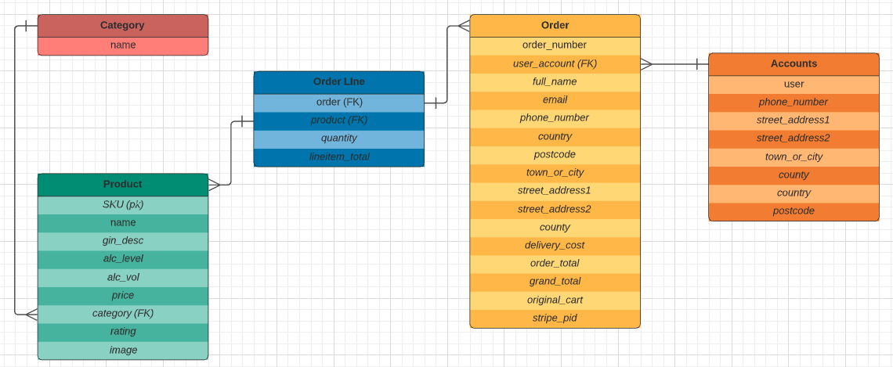
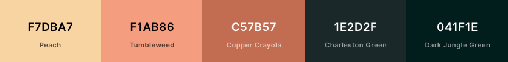
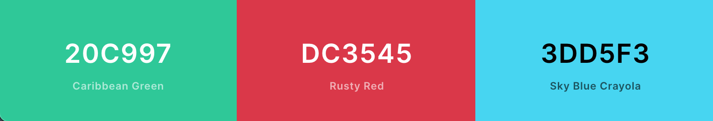

    
    <h1>justGin</h1>

You guessed it. 

We sell gin.

Our shop is going to get bigger, and it's going to get harder to choose. justGin is a project, developed as part of my (William Marjoribanks') fourth and final Milestone within the curriculum at Code Institute, Dublin.

It has been deployed to [Github Pages]() and [Heroku]().

---

## README Document Navigation

* [UX](#ux)
  * [Concept](#concept)
  * [User Stories](#user-stories)
    * [Customer Stories](#customer-stories)
    * [Administrative Stories](#administrative-stories)
  * [Wireframes](#wireframes)
  * [Database Structure](#database-structure)
  * [Design](#design)
    * [Colour Scheme](#colour-scheme)
    * [Typography](#typography)
    * [Imagery](#imagery)
* [Features](#features)
  * [Existing Features](#existing-features)
    * [Home Page](#home-page)
    * [Product Catalogue](#product-catalogue)
    * [Product Details](#product-details)
    * [User Account](#user-account)
    * [Shopping Cart](#shopping-cart)
    * [Payment](#payment)
    * [Admin Features](#admin-features)
  * [Future Implementations](#future-implementations)
* [Technologies Used](#technologies)
  * [Languages and Frameworks](#languages-and-frameworks)
  * [Libraries and Programs](#libraries-and-programs)
* [Testing](#testing)
* [Deployment](#deployment)
    * [Local Deployment](#local-deployment)
    * [Deployment to Heroku](#heroku-deployment)
* [Media](#media)
* [Acknowledgements](#acknowledgements)

---

## UX
### Concept

It's been a really horrid year for everyone this year. Unless of course, you've enjoyed not having to make small talk at work during your half-hour break or commuting every day in the pouring rain - justGin is based in Scotland, so it  <em>always</em> rains. <strong>Always</strong>. 
 

But now that society is regaining a slice of freedom by the week, and restrictions aren't as strict. It's time to celebrate - safely and responsibly. And why not with a bottle (or two) of premium artisanal gin? Well justGin, provides their users with a platform to do just that at affordable prices and some advice on pairings and flavour notes.

### User Stories

#### Customer Stories

| **As a customer and/or mixologist I would like to** | **So I Can**                            |
| -------------------------------------------------- | --------------------------------------------- |
| Browse products.                                   | Search for new and already tried gins.        |
| Filter products by origin, price, name.             | Compare the choices between justGin and other resellers.                                                                                                 |
| Search for Gin using the search bar.               | Filter Gin by a descriptive keyword.|
| See details about a product.                       | Make a responsible purchasing decision.       |
| Buy a product from the shop.                       | Enjoy and share it with others.               |
| View my shopping cart before purchasing.           | See a cost breakdown before the purchase.     |
| Update my shopping cart.                           | Make any final decisions before ordering.     |
| Pay via a credit/debit card.                       | Complete a purchase.                          |
| Receive an email confirmation about my order.      | To be provided with proof of purchase for any potential issues.|
| Create an account.                                 | To speed up future orders and view past orders.|
| Amend my account details.                          | Be informed about orders and offers by justGin.|
| View my order history                              | Be reminded of previous purchases.            |
| See what is new to the store.                      | Try the newest gins to share with others.     |

 

#### Administrative Stories

| **As an Administrator I would like to**     | **So I Can**                                     |
| ------------------------------------------- | ------------------------------------------------ |
| Add/Update/Remove new/existing products in the store. | Ensuring stock is relevant.            |
| Retrieve customer purchases.                | Complete the order and send the item out to the customer.|
| Mark a product as clearance/sale or new.    | Ensure customers have the best deals to premium quality alchohol, supporting local businesses.             |

### Wireframes

The wireframes created with [Balsamiq]('https://balsamiq.com') at the beginning of the project and used as a reference throughout are situated in a dedicated folder entitled 
['wireframes'](https://github.com/LHBank/justgin/tree/master/wireframes), at project level. It contains screenshot images, for both the Mobile, Tablet, and Desktop viewport screen sizes, due to the use of Bootstrap 4, and the prioritisation on Mobile-first devices.

### Database Structure

### Design

A custom CSS file, placed within the static folder of justGin, was used in conjunction with [Bootstrap 4](https://getbootstrap.com/docs/4.5/getting-started/introduction/), which served as the main CSS library. [Materialize](https://materializecss.com/) was also used, however only for use of its vast library of icons. [Animate.css](https://animate.style/) was also utilised on the home page or, index.html within the home app, for the entry tagline and shop now button. It wasn't used anywhere else, as I felt it had a bigger impact by being used less. [Animate On Scroll](https://michalsnik.github.io/aos/) was used only on the products page, to show products only as the user scrolled down the page.

### Colour Scheme

As with all online platforms, a consistent colour palette is fundamental to a satisfying user experience. There are different outcomes when using the right colour scheme and with trying to keep a sense of elegance and style within the site, is why this particular colour palette was chosen from [Coolors](https://coolors.co/). Three of the five colours presented were predominantly used.

* 'Copper Crayola' was used throughout for headings, buttons and the ratings feature - which is how a product on the site is graded, by the admin user.

* 'Dark Jungle Green' was used as an alternative to black. 

* 'Peach' was used as an alternative to white. Although dependent on the responsiveness in screen size, #FAFAFA - an off-white - was also used as a more effective contrasting colour.

    

The 'update', 'edit' or 'delete' links utilised standard conventions of green, red and blue. These colours were also used against the Toast feature, to demonstrate the success or failure of an item being added or removed from the shopping cart.

    

### Typography

Text content throughout the site was kept to a minimum of two font-families. All headings utilised the Spartan font-familiy from GoogleFonts, and likewise, all links/inputs/paragraph elements used Quicksand, also from GoogleFonts. There were subtle contrasts between the two fonts, yet weren't garish or difficult to read.

### Imagery

The imagery used, had to be of good quality to convey a message that any orders from justGin, were providing only premium brand products. It was also therefore important, that distracting CSS was kept to a minimum and imagery, was simple, relying partly too on the description provided. A simple layout, with minimal pastel colours brought the design, an element of elegance and sophistication.

## Features

### Existing Features

#### Home Page

On the opening Homepage of justGin, displayed is a responsive Navigation bar, containing a search box designed to work with the Products offered by justGin, an account link - for users to view previous orders, and alternatively for Admin to manage product inventory - as well as a shopping cart, which stores a user's potential order.

The main contents of the Homepage, is kept to a minimum. As mentioned previously, this is due to not wanting to overcrowd the site with unnecessary CSS distractions.

The lower Navigation bar, which toggles into a dropdown menu on mobile devices, contains the site's navigation, more specifically for: All Products, About, Info & Blog (which is being considered as a future implementation).

#### Product Catalogue

When navigating to the justGin store, there are various different options to aid the user in finding a product they are looking for. These are:

* A form utilising a search box which is used by entering a keyword. This is accessible on all screen sizes.
* A category tag within the product card, which lists a Gin by its origin. This is marked with the icon: "  "
* A "Sort By" box located in a row, above the product catalogue.

#### Product Details

A user visiting the site can click on the card of a specific Gin, which will redirect to a screen providing the following information:

* Product Name
* Image
* Price
* Rating
* Description
* Alcohol Level (ABV)
* Alcohol Volume (cl)

Beneath this list of details, is a amount quantity with corresponding incremental and decremental buttons, as well as two links. One which allows the user to navigate back to the Product Catalogue, and another which provides the user with the option to checkout.

#### User Account

Creating an account with justGin is straightforward and can be done so using the 'My Account' button in the navigation bar, as well as in the Checkout page, which is displayed once a user has confirmed their order, and proceeds to the purchase stage. The accounts element allows users the following functions:

* Update their default delivery details.
* View previous orders.

#### Shopping Cart

This area of the site, is dedicated to storing the session users order until the purchase/checkout stage.

* Gin selections for purchase, are entered into the cart.
* The cart will show a sub-total and a grand-total. This will factor in a delivery cost if the customer has/hasn't spent enought to warrant free delivery.
* As with the Product Details page, item quantities can be adjusted via incremental/decremental buttons.
* Selections can be removed from the cart, by using the 'remove' link, or by decreasing the quantity amount to 0.

Following this, there is a button to further the process to checkout.

#### Payment

If a return user is shopping through justGin, and has signed into their account, and they have continued to the checkout page, the page will display their default delivery information via a form, as well as the order details/summary includign the grand-total.

If, however, a user has not yet made an account, and hasn't signed in, then the delivery/customer form will display as empty and as such will need to be completed before a purchase is created.

All payments are made through card using [Stripe](https://stripe.com/). To test this feature, please see the [TEST.md](https://github.com/LHBank/justgin/blob/master/TEST.md) document to see a successful purchase.

#### Admin Features

Whilst signed in as an Admin/Superuser, functionality not available to non-superuser users, is available. This includes being able to:

* Edit/Delete an existing product. This can be accessed via the 'Edit' & 'Delete' links against each product.
* Adding a new product, via the 'Product Management' link, accessible from the user icon in the Navbar.

### Future Implementations

Currently, there has been a page allocated to a 'Blog' page in the site. Although, this has purposely been left with a 'Coming Soon' title, ideally, it would be beneficial to allow an Admin user update this page with in-depth video reviews, recommended Gin distillery visits, and offers only available to those who sign up with justGin.

In addition to this it would be in the best interests of justGin to implement a newsletter which users could sign up to and be notified of any updates, from the above features.

## Technologies
### Languages and Frameworks
* HTML
* CSS
* JavaScript/jQuery
* Python
* Django

### Libraries and Programs
* [Github](https://github.com)
* [Gitpod](https://gitpod.io/)
* [Visual Studio Code](https://code.visualstudio.com/) - Previously used to test various possibilities for site, before primarily using Gitpod as IDE.
* [Heroku](https://tinyurl.com/4dfm8ypp)
* [Django](https://www.djangoproject.com/)
* [Bootstrap 4](https://getbootstrap.com/) - Main CSS Framework
* [Materialize](https://materializecss.com/) - Various icons used.
* [AWS](https://tinyurl.com/trz8dssh) - Image storage provided by Amazon Web Services
* [Stripe](https://stripe.com/gb) - Payment solution for online businesses.
* [Font Awesome](https://fontawesome.com/)
* [Animate.css](https://animate.style/)
* [Animate On Scroll](https://michalsnik.github.io/aos/)
* [Google Fonts](https://fonts.google.com/)
* [Coolors](https://coolors.co/) - Colour Palette Generator
* [Balsamiq](https://balsamiq.com) - Wireframes
* [LucidChart](https://lucid.co/) - File structure diagram creation.
* [w3Schools.com](https://www.w3schools.com) - Reference purposes.

## Testing

The following document, [TEST.md](https://github.com/LHBank/justgin/blob/master/TEST.md) has been created to record the manual testing carried out throughout the project.

## Deployment
#### Local Deployment

#### Heroku Deployment

## Media
<strong>Product images used throughout the project, specifically in the product app, were obtained from the following online supermarkets and resellers:
</strong>

* [Sainsburys](https://www.sainsburys.co.uk/)
* [Asda](https://www.asda.com/)
* [Master of Malt](https://www.masterofmalt.com/)
* [Virgin Wines](https://www.virginwines.co.uk/)

<strong>Hero Images for the main site background, 'About' page and 'Info' page, were obtained from the owners via [Pexels](https://www.pexels.com/):</strong>

* [Hero Image - base.html](https://www.pexels.com/photo/food-cold-sand-alcohol-8084719/)
* [Hero Image - about.html](https://www.pexels.com/photo/lemonade-on-brown-surface-616836/)
* [Hero Image - info.html](https://www.pexels.com/photo/food-cold-red-blue-4702421/)

## Acknowledgements
*  As mentioned in my penultimate project, my thanks to the Student Care team at Code Institute again for their support and understanding during a particularly difficult time, whilst I, like many other students, were also taking on the challenge of learning new technologies taught through their Full Stack Web Development Course.

* My thanks to Felipe Alarcon, my mentor through Code Institute, who has been encouraging and available to talk to whenever I've 
found myself unable to comprehend certain elements of advanced technologies. His helpful nature, and commitment to the students
he is responsible for assisting where he can, - from my own experience - has been consistent from the commencement of the course, and I am grateful for this.

* This project-concept, "justGin", has been created by W. Marjoribanks, and shares similar syntax to that of a Walkthrough Project 
currently in place by Code Institute, Dublin.