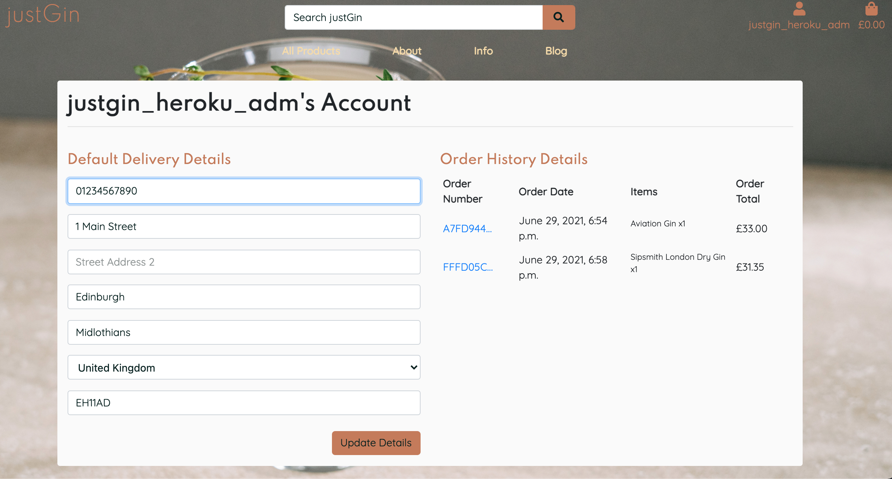
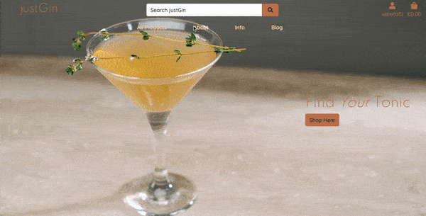
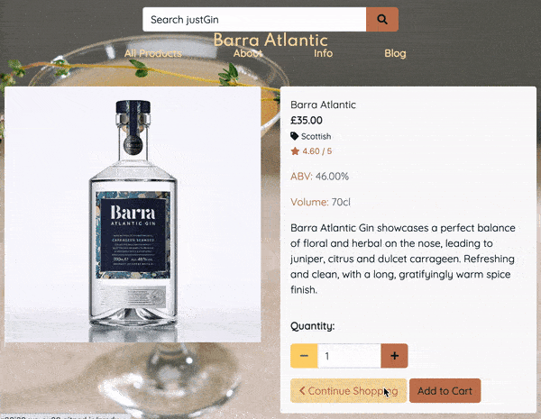
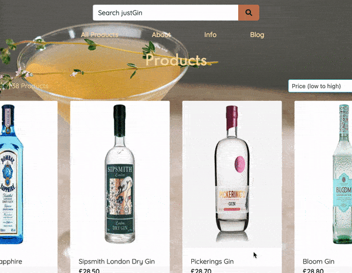
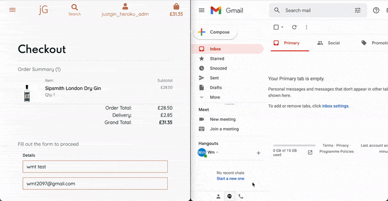
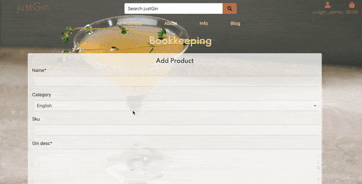
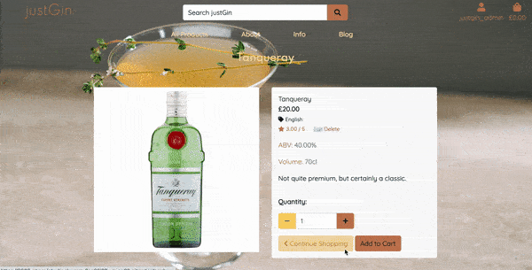
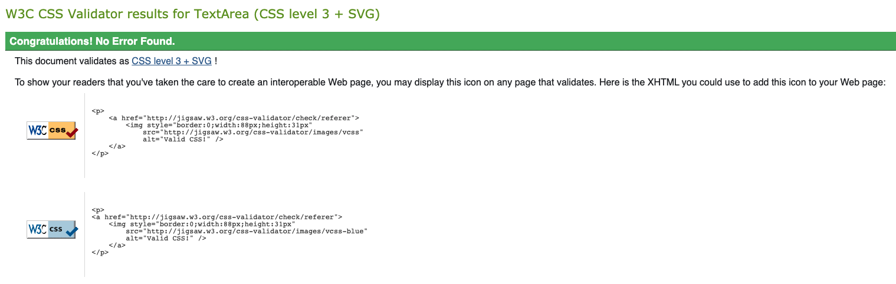
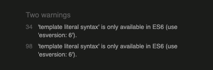
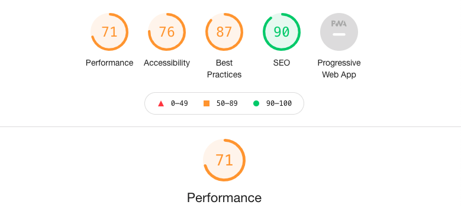

<span>
    
    <h1>justGin</h1>
</span>

## Testing

During the development of 'justGin', I made the decision to manually test the components featured on the site, so I had an understanding of my mistakes, and how the features I chose to implement were going to be accessed by other users. across various device-types. This brought an element of difficulty to an already large enough challenge whilst working with Django, however am happy with the end result.

---
## TEST Document Navigation
* [Pages and Features](#pages-and-features)
    * [Home Page](#home-page)
    * [Product Catalogue and Details](#product-catalogue-and-details)
    * [User Account](#user-account)
    * [Shopping Cart and Payment](#shopping-cart-and-payment)
    * [Admin Features](#admin-features)
    * [Error Handling](#error-handling)
* [Validation](#validation)
    * [HTML](#html)
    * [CSS](#css)
    * [JavaScript](#javascript)
    * [Python](#python)
* [Responsive Design](#responsive-design)
* [Speed Testing](#speed-testing)


---
## Pages and Features

### Home Page
As a user visiting the site, they are directed to the Homepage. It was designed to be kept simple, free of clutter, and of too many interactive components. For that reason, all that remains, is a Navigation bar, Search form, as well as User Account and Shopping Cart link icons. The main navigation links are toggled on mobile devices via icons at the top of the browser window, with a resized brand icon.

In the centre right of the page, both on large/medium/small screen sizes, sits a button which will redirect the user to the Product Catalogue.

Due to its positioning, this encourages the user to navigate to the product page as that tends to be the first thought of a shopper.

### Product Catalogue and Details
A new user of the site can navigate easily to the the Product Catalogue via the navigation bar, accessible from the top of each page, on all screensizes. The Navigation options will display as a dropdown menu on tablet and mobile screens. 

To ensure that the Search Box was functional, it utilised the json fixture files to focus on the flavour of the gin and its description, and ingredients, whilst filtering out gins that were perhaps not to a user's taste.

<div>
    
</div>

Alternatively, once on the Product Catalogue page, a number of additional methods to filter desired gins was applied using a 'Sort by' input field, and also tags that a user could click on, which filtered Gins by their category/origin.

<div>
    
</div>

### User Account
Due to the considerable amount of data passing through the site, taking into consideration the need to making payments, and updating a user's details when it came to making recorded purchases, it was important to differentiate 'Superusers'/(Admin) rights - which will be detailed further below - and regular customers/mixologists. With these two categories, of course there were similarities, one such example seen below, was the 'Account' page:

<div>
    
</div>

However, when making a purchase, the user is given the option to proceed without signing up as a user, however would therefore forego the ability to have an Order History with justGin as you will see to the right of the image above. 

When clicking on the on a previous order's link, it will direct you to the generated id of the page associated with that order, and a toast alert will flash on the page, to inform the user that an email confirmation was sent on the day of purchase.

### Shopping Cart and Payment

Stripe, an online service which assists businesses in conducting transactions - both online and in retail outlets - was used to process user orders on the justGin platform. Within the Stripe developer documentation, there are designated card numbers i.e. credit/debit cards which can be used to test the integrated functionality. In order to test a successful payment, and prevent any orders being processed, for example if a user leaves the site prematurely. 

The following card number can be used: 

* Card Num.: 4242 4242 4242 4242
* Exp. Date: Any number pair, eg. 07/21
* Signature Strip number: 3 digits eg. 167
* Zip Code: 5 digits eg. 45832

<div>
    
</div>

If a user gets to the shopping cart, having added items to their cart, and they decide they want to alter the amount, or remove something altogether, this can be done using increment and decrement buttons within the Shopping Cart page.

Only certain fields within the form collect user day regarding a shipping address, were designated as required. This was of course because not everyone has more than one line in their address.

<div>
    
</div>
<br>
<div>
    
</div>

Once a purchase has been processed by Stripe and the Webhook has been successfully handled, the user will recieve a confirmation email direct to the inputted email address.

<div>
    
</div>

### Admin Features
As previously mentioned, admin users had a wider range of abilities to better serve the customers. This meant being able to add, edit and delete items within the store. Naturally, this could be done through the ```/admin``` site when typed in after the site url, however it was important that there was a more user-friendly experience for site-owners/admin account holders.
<div>
    
</div>
<br>
<div>
    
</div>

#### Error Handling
To prevent non-authorised users from having the ability to carry out product addition/editing/deletion within the site, parameters had to be met in views.py. For example, a user had to be logged in and a superuser to carry out the above features. As can be seen below:

<div>
    
</div>

Instead of creating a designated error page, for attempting to access a site page whilst unauthorised, the Toast function alerts the user, that they are prohibited from this feature.

---
## Validation

### HTML

### CSS

Using [W3C](https://jigsaw.w3.org/css-validator/) CSS validation, the following report was provided:

<div>
    
</div>

### JavaScript

JSHint was used to validate the JavaScript used within the application, and in two files, the only resulting warning, referenced template literal syntax, as seen below.

<div>
    
</div>


### Python

To ensure that all Python files were compliant with Pep8 standards, I manually tested all files by installing autopep8. This works by inputting the file you wish to be checked preceeded by autopep8 --aggressive.

    Example:

        autopep8 --aggressive checkout/views.py

On occasion, there were instances where Python syntax couldn't be formatted, due to repercussions that would ensue. These often occurred because of ```KEYS``` which, if altered, would affect the project's functionality.

## Responsive Design

As this platform was built upon the concept that a user be able to access their account, providing they had an internet connection, it was vital
that it be available across multiple screen sizes, i.e. Mobile, Tablet and Desktop. 

Using various browser Developer Tools; Chrome, Safari and Opera and testing different viewport windows, such as:
  * Google Pixel
  * Huawei Mate 20X
  * Samsung Galaxy Z
  * iPhone Models 5, 6, and 11
  * iPad Pro
  * MacBook Pro

 
No errors presented themselves at time of testing using the above browsers.

## Speed Testing

I used Lighthouse within Chrome Developer Tools, to check the speed of the site. The site's results were in all fairness, above average and this was due to certain UX choices, such as a navigation bar with no background colour and the image sizes, despite being compressed, were large enough to impact the overall performance.

<div>
    
</div>